# Sakura Room

*Il mio percorso per completare la storica room creata da OSINT Dojo su TryHackMe*

**Erika Pellegrino**
*08 set 2026*

Questo non vuole essere l'ennesimo walkthrough della Sakura Room di TryHackMe, una room ormai storica, risolta e raccontata da innumerevoli persone negli anni. L'obiettivo di questo articolo è diverso: raccontare onestamente il percorso di apprendimento che ho affrontato con questa room, task dopo task, comprese le difficoltà e, soprattutto, i concetti che ho imparato grazie a questa sfida.

> **Nota:** online si trovano molti walkthrough di questa room. Se vuoi risolvere tu stesso questa room senza spoiler, dovresti fermarti qui. Se invece stai cercando un altro write-up con cui confrontare il tuo lavoro, sei nel posto giusto.

## TASK 1 - INTRODUCTION

> **ID:** THM-01 SAKURA ROOM (CTF)
> **ANALISTA:** ERIKA PELLEGRINO
> **DATA DELL'ANALISI:** 09/04/2026
> **TARGET:** SakuraSnowAngelAiko by OSINT Dojo
> **AMBITO DELL'ANALISI:** analisi OSINT dell'identità digitale e delle tracce online lasciate da un attaccante fittizio (SakuraSnowAngelAiko), partendo da un'immagine indizio, con l'obiettivo di identificare il suo username, l'email, il nome reale, il wallet crypto, la rete Wi-Fi domestica e la probabile città di residenza.
> **METODOLOGIA:** SOCMINT, BLOCKINT, GEOINT — ricerca passiva, nessuna interazione diretta con il target
> **GitHub:**

Il primo task è puramente introduttivo: OSINT Dojo dà il benvenuto nella Sakura Room su TryHackMe. Il testo introduttivo spiega che la room è pensata per mettere alla prova un'ampia gamma di tecniche OSINT diverse. Ogni sezione offre indizi utili a raccogliere le informazioni necessarie per rispondere alle domande dei task. Tutte le risposte devono essere ottenute tramite tecniche di ricerca passiva.

## TASK 2 - TIP-OFF

Con il Task 2 il CTF inizia davvero.

**Scenario:** OSINT Dojo è stato vittima di un attacco informatico. Durante l'indagine forense, gli amministratori del team hanno trovato un indizio lasciato dal cybercriminale: un'immagine scaricabile. La prima domanda chiede lo username dell'attaccante.

**Procedura:**

Con un'immagine come indizio, la prima cosa da fare per ottenere informazioni sarebbe analizzarne i metadati, ad esempio con exifeditor.io. Tuttavia, salvando la foto, ho notato che il formato non era un classico PNG o JPEG, bensì un SVG (Scalable Vector Graphics).

Questo formato di immagine non si basa su una griglia di pixel ma sulla grafica vettoriale. A differenza delle immagini tradizionali, che contengono una mappa di punti colorati, un file SVG contiene istruzioni matematiche e codice in formato XML (eXtensible Markup Language). L'XML è un formato testuale pensato per archiviare, organizzare e trasportare dati in modo comprensibile sia dagli esseri umani sia dalle macchine.

Per ottenere più informazioni da un'immagine SVG, basta salvarla e aprirla con un editor di testo (Notepad, Visual Studio Code, ecc.) invece che con un visualizzatore di immagini. Facendo così viene rivelato l'intero codice sorgente.

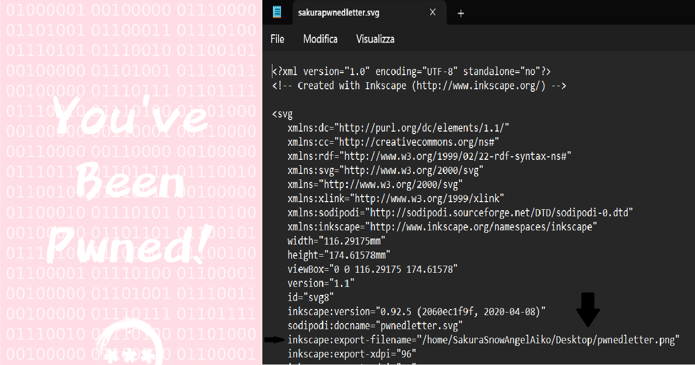
*Immagine indizio e codice sorgente*

Leggere il codice sorgente mi ha dato la risposta alla prima domanda: il nome dell'attaccante è *SakuraSnowAngelAiko*, trovato nella directory personale in cui era stata salvata l'immagine. Il formato `/home/username/Desktop/…` è tipico dei sistemi Linux.

**Cosa ho imparato:**
- Cos'è un'immagine SVG e in cosa differisce dai formati di immagine più tradizionali; l'importanza analitica del codice sorgente in un'indagine.

## TASK 3 - RECONNAISSANCE

Avere uno username è un buon punto di partenza per trovare ulteriori informazioni. Il Task 3 fa notare che le persone spesso riutilizzano lo stesso username su più piattaforme, quindi è probabile che lo stesso username sia stato usato per iscriversi ad altri servizi web, come i social network. La room suggerisce di cercare username corrispondenti su altre piattaforme, facendo attenzione ai falsi positivi.

In questo task ci sono due risposte da trovare: l'indirizzo email dell'attaccante e il suo nome completo.

**Procedura:**

Esistono diversi metodi per trovare piattaforme social collegate a uno username: Google Dorking, strumenti come Sherlock o Maigret, oppure tool web come WhatsMyName. Per questo esercizio ho scelto quest'ultimo, considerato uno degli strumenti più affidabili e attivamente mantenuti nel campo OSINT.

Inserendo lo username *SakuraSnowAngelAiko* nella barra di ricerca dello strumento, ho ottenuto una serie di risultati contrassegnati con tre colori — verde, giallo, rosso — dal più affidabile al probabile falso positivo fino al non trovato. L'unico risultato certo si è rivelato essere un profilo GitHub.

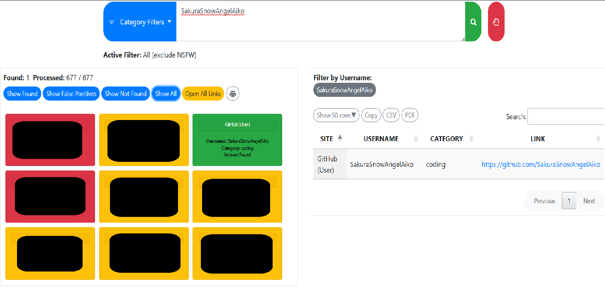
*Risultati WhatsMyName*

Per completezza e a scopo di apprendimento, ho controllato velocemente anche i risultati evidenziati in giallo, cioè i "potenziali" falsi positivi. Tutte queste pagine si sono rivelate o inesistenti (errore 404) o non pertinenti allo scopo della ricerca. Riguardo ai falsi positivi, è utile sapere che quando si cerca uno username, molti siti in cui quello username non esiste realmente non restituiscono un chiaro errore "404 - not found", ma mostrano invece una pagina generica con un codice di risposta "200 OK", che normalmente indica "pagina trovata con successo". Uno strumento automatizzato come WhatsMyName, che si basa esclusivamente sul codice di risposta HTTP, non può fidarsi completamente di questi siti specifici, e quindi li segnala come "potenziale falso positivo" anziché "trovato". Come sto imparando, è buona pratica non lasciare nulla al caso, ma è altrettanto importante non perdersi in ogni minimo dettaglio quando l'evidenza (in questo caso, pagine vuote o non pertinenti) è già abbastanza chiara.

A questo punto ho aperto il profilo GitHub. L'handle nella pagina principale corrisponde; il nome visualizzato è *Aiko*. Ci sono 5 repository in evidenza, 2 dei quali appartengono all'utente e 3 sono fork. In totale ci sono 9 repository.

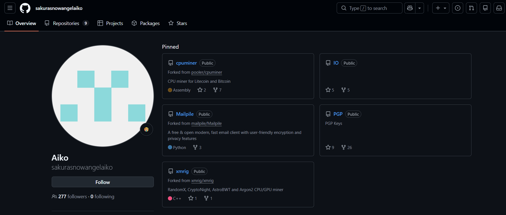
*Panoramica del profilo GitHub*

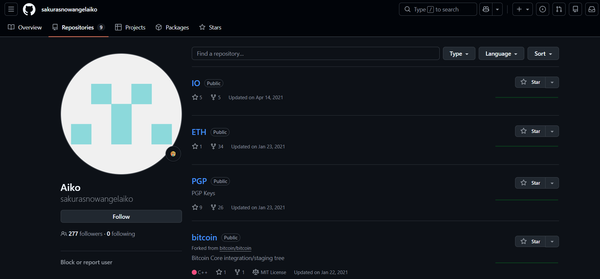
*Repository pubblici di Aiko*

Ho quindi cercato indizi tra i vari repository. Il repository "IO" non sembra contenere indizi utili. Ho poi aperto il repository "ETH", che contiene il file "miningscript", all'interno del quale si trova il primo indizio: un URL di connessione (stratum) a una mining pool che include, tra le altre cose, un indirizzo di un wallet ETH.

Salvato questo indizio, ho continuato a scorrere i repository. Il terzo è il repository "PGP", che contiene un altro indizio: una chiave pubblica codificata in Base64, un formato usato per rappresentare dati binari come testo.

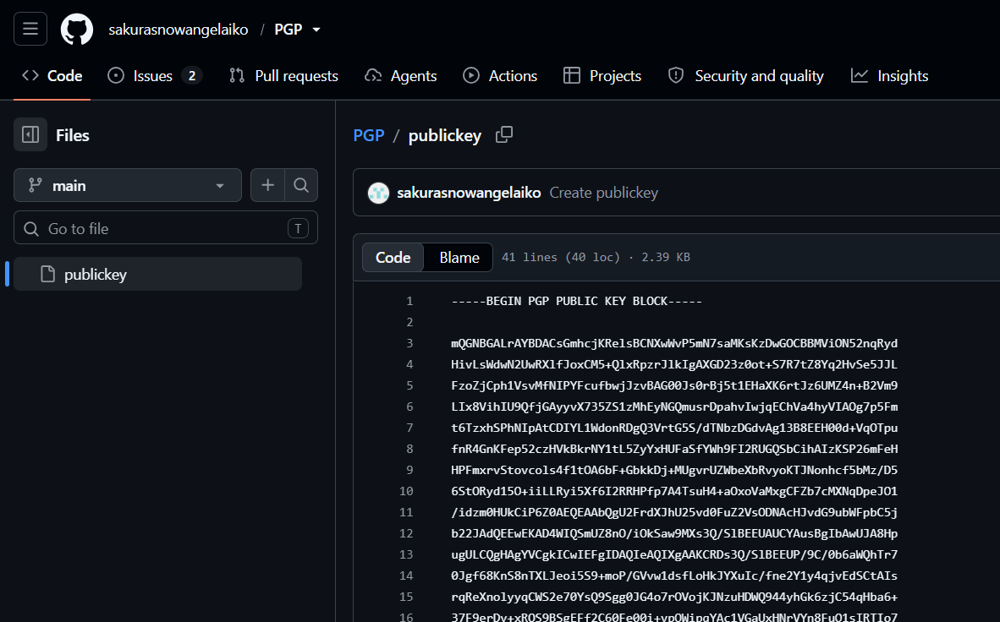
*Chiave pubblica in Base64 nel repository PGP*

Dato l'obiettivo prioritario del Task 3, il primo passo è stato decodificare la chiave pubblica. Per farlo ho usato GPG Decoder, uno strumento web gratuito progettato appositamente per "aprire" una chiave PGP (Pretty Good Privacy), estrarne il contenuto e mostrarlo in forma leggibile. Una chiave PGP è in realtà composta da una chiave pubblica e una privata. La chiave pubblica è un valore numerico che può essere condiviso con chiunque, in modo che possa inviare messaggi cifrati o verificare firme digitali. Chi vuole conoscere il contenuto deve usare questa chiave per decifrare i dati. La chiave privata, invece, è conservata dal proprietario e non deve mai essere divulgata. Viene usata esclusivamente per decifrare i messaggi ricevuti o generare firme digitali. Questa è la crittografia asimmetrica: un messaggio inviato usando la chiave pubblica del destinatario può essere letto solo da chi possiede la corrispondente chiave privata.

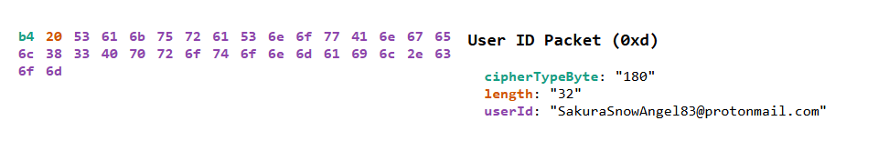
*Decodifica della chiave pubblica*

La decodifica ha rivelato la risposta alla prima domanda del Task 3, ovvero l'indirizzo email dell'attaccante: **SakuraSnowAngel83@protonmail.com**.

Ottenuta questa email, ho provato diversi approcci per sfruttarla e trovare la risposta alla seconda domanda del Task 3, cioè il nome completo dell'attaccante. Ho usato vari Google dork, più o meno stringenti, senza ottenere risultati utili. Quasi per caso, ho provato a cercare su Google il nome completo *SakuraSnowAngelAiko* ma scritto in linguaggio naturale: *Sakura Snow Angel Aiko*. Solo così sono riuscita a trovare una pagina X (Twitter) appartenente ad Aiko.

> **NOTA:** avendo già svolto l'esercizio autonomo SOCMINT-01 con questo stesso account come target ("Username Enumeration, Cross-Platform Correlation and Manual Verification: a SOCMINT case study", disponibile su questo profilo), sapevo già che quella pagina esisteva, eppure non ero riuscita a trovarla con dork rigidi e specifici (virgolette, operatori `site:`); è stata una ricerca testuale meno vincolata a farla emergere.

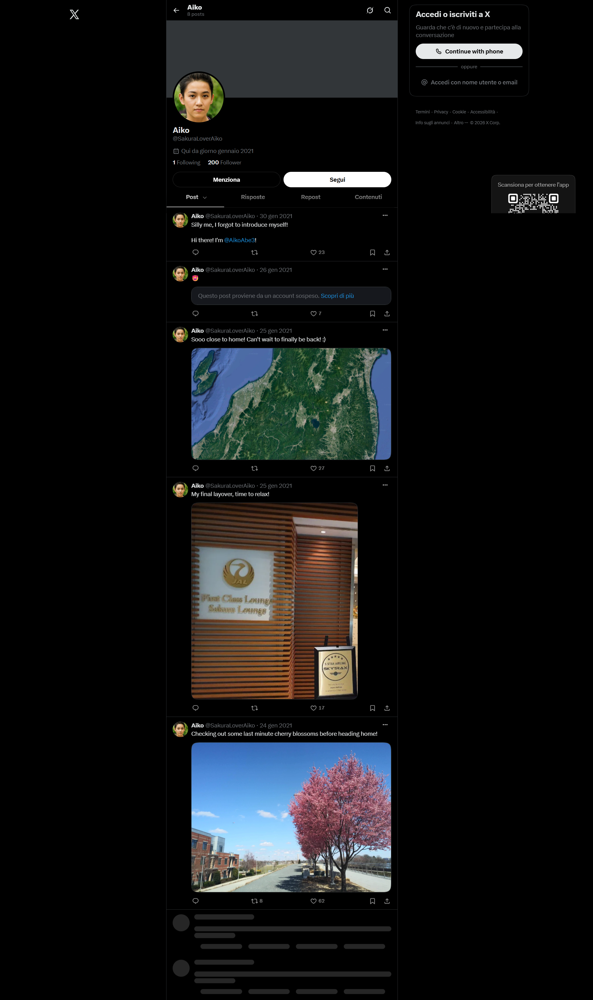
*Profilo X di Aiko*

Il primissimo tweet ha dato la risposta alla seconda domanda del Task 3: **Aiko Abe**.

*Tweet "I'm AikoAbe3"*

Terminato il Task 3, mi sono fermata a esaminare con attenzione il profilo X di Aiko, annotando su Obsidian ciò che vedevo:
- un tweet in cui si presenta come "@AikoAbe3"
- un post che sembra sospeso/rimosso
- un'immagine satellitare di una regione
- un'immagine in cui dice di essere al suo ultimo scalo prima di tornare a casa
- un'immagine con un ciliegio in fiore lungo un lungo viale, in cui dice di essersi fermata ad ammirarlo prima di fare il check-out e tornare a casa

**Cosa ho imparato:**

Fare attenzione ai falsi positivi e capire cosa vale la pena approfondire e cosa no; come si può decodificare una chiave pubblica e quanto possa essere ricca di informazioni; come un dork troppo rigido possa fallire laddove una ricerca testuale più naturale ha successo, quindi vale sempre la pena provare entrambi gli approcci prima di considerare esaurita una pista.

## TASK 4 - UNVEIL

Nel Task 4, gli indizi rimandano alla cronologia dei commit dei repository GitHub, mentre le domande riguardano il mondo delle criptovalute. Era chiaro che le risposte fossero collegate all'indizio "stratum" trovato in precedenza nel repository ETH.

**Procedura:**

Sono tornata al repository ETH e ho osservato più da vicino la cronologia dei commit in cui avevo già individuato l'indirizzo del wallet. Nella cronologia c'era un commit precedente che mostrava apertamente l'indirizzo del wallet. Anche se il file era stato successivamente modificato per ripulire i dati sensibili esposti, la cronologia dei commit immutabile di GitHub ha comunque permesso di recuperare la versione originale.

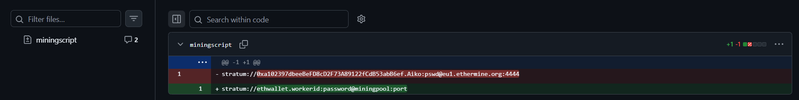
*Cronologia di miningscript e indirizzo del wallet ETH*

Come mostrato, il commit originale rivela l'indirizzo del wallet: `0xa102397dbeeBeFD8cD2F73A89122fCdB53abB6ef`.

Un URL in formato Stratum è lo standard che un miner (cioè un individuo o un'entità che dedica il proprio computer al mining — il processo con cui vengono create nuove criptovalute e le transazioni vengono verificate e aggiunte alla blockchain) usa per connettersi, ovvero "presentarsi", a una mining pool per ricevere le ricompense in criptovaluta. È come una consegna a domicilio: prima di ricevere qualcosa, bisogna indicare con precisione dove consegnare, chi sta ordinando e da dove. La struttura generale `stratum://[indirizzo_wallet].[worker_id]:[password]@[pool_server]:[porta]` mostra ogni componente che identifica una parte della configurazione:

- l'**indirizzo del wallet** è l'indirizzo di consegna — è qui che arrivano le ricompense; un errore qui significa che qualcun altro riceverà la ricompensa;
- il **worker ID** è come il nome scritto sul citofono — utile se più dispositivi lavorano sullo stesso wallet contemporaneamente, poiché permette di capire quale sta effettivamente producendo cosa;
- la **password** serve solo a confermare l'ordine;
- **server e porta** sono l'indirizzo del negozio a cui ci si connette per effettuare l'ordine — cioè la mining pool stessa.

Con questo indizio è stato possibile rispondere alla prima domanda del task: la criptovaluta del wallet dell'attaccante è **Ethereum (ETH)**. La seconda domanda chiedeva l'indirizzo del wallet, cioè lo stesso indirizzo recuperato dal commit eliminato mostrato sopra.

La terza domanda è più specifica: chiede da quale mining pool l'attaccante abbia ricevuto pagamenti il **23 gennaio 2021**. La data del commit su GitHub corrisponde. Per approfondire e trovare la risposta a questa domanda, ho usato **Etherscan**.

Etherscan è un block explorer, cioè un motore di ricerca che permette di navigare la blockchain di Ethereum in tempo reale. La sua interfaccia rende leggibili dati che altrimenti esisterebbero solo come un flusso grezzo distribuito su migliaia di nodi in tutto il mondo. Questo strumento si usa per consultare indirizzi, transazioni, smart contract e molto altro. Inserendo l'indirizzo del wallet su Etherscan, la pagina di panoramica mostra alcune informazioni chiave sull'indirizzo: il saldo ETH attuale e il suo valore in dollari, i tag associati all'indirizzo, la data della prima e dell'ultima transazione effettuata e l'indirizzo che lo ha finanziato per la prima volta ("funded by"); più in basso, una tabella elenca le transazioni dell'indirizzo in ordine cronologico con hash, mittente, destinatario, importo e gas fee per ciascuna.

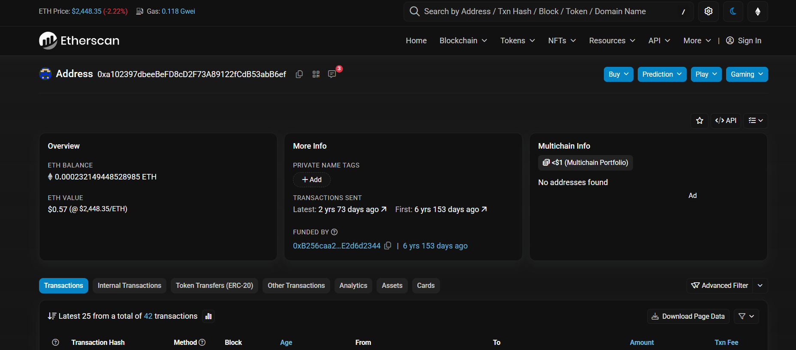
*Panoramica dell'indirizzo ETH*

In questo caso, l'indirizzo aveva un totale di 42 transazioni. Dovevo trovare quella del 23 gennaio 2021. Facendo un calcolo approssimativo, si trattava di circa 2050 giorni prima della data attuale. Scorrendo l'elenco delle transazioni, sono arrivata a quell'intervallo di giorni e, passando il cursore sul campo "Age" di ciascuna transazione vicina a quel numero, sono riuscita a leggere la data/ora esatta e identificare quella del 23 gennaio 2021.

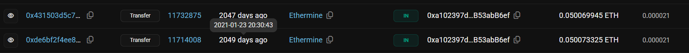
*Transazione del 23 gennaio 2021*

Questo mi ha permesso di rispondere alla terza domanda. La mining pool da cui l'attaccante ha ricevuto pagamenti in quella data è **Ethermine** (la colonna "From").

L'ultima domanda del Task 4 chiede quale altra criptovaluta l'attaccante abbia scambiato usando il proprio wallet. Su Etherscan, la pagina di un indirizzo ha diverse schede oltre a quella predefinita "Transactions"; tra queste c'è anche "Token Transfers (ERC-20)", che mostra solo i movimenti di token — diversi dall'ETH nativo — effettuati da quell'indirizzo.

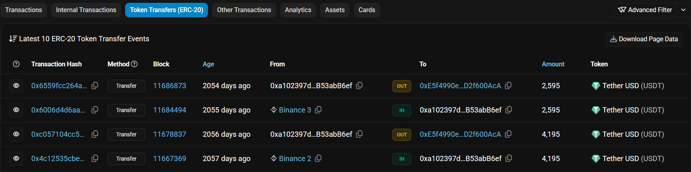
*Scheda Token Transfers (ERC-20)*

L'immagine mostra che l'altra valuta usata dall'attaccante è **Tether**.

**Cosa ho imparato:**

Questo task mi ha permesso di imparare le basi del mondo della blockchain e delle criptovalute: come leggere una pagina di Etherscan; come avviene una transazione e quali elementi sono necessari per effettuarla.

## TASK 5 - TAUNT

Nel Task 5, l'attenzione torna sull'account X, la cui pagina completa e i cui dettagli avevo già salvato in precedenza. Gli indizi di questo task rimandano a uno screenshot di un messaggio che l'attaccante ha inviato a OSINT Dojo su Twitter, e suggeriscono anche di seguire le piste dall'account verso il Dark Web.

**Procedura:**

Rispondere alla prima domanda del Task 5 è stato facile. Chiedeva semplicemente l'handle del profilo, ovvero: **SakuraLoverAiko**.

La seconda domanda del task chiedeva invece il **BSSID** della rete Wi-Fi domestica dell'attaccante. Il BSSID (Basic Service Set Identifier) è l'indirizzo fisico univoco di un access point — il dispositivo (router o ripetitore) che trasmette il segnale Wi-Fi.

Qui è importante comprendere una distinzione fondamentale tra BSSID e SSID. L'SSID è il nome della rete Wi-Fi: scelto liberamente durante la configurazione del router (ad es. "home1234") e modificabile a piacimento. Il BSSID, invece, è l'indirizzo fisico del dispositivo che trasmette quella rete. È come l'indirizzo di casa univoco del dispositivo stesso, legato all'hardware specifico piuttosto che alla scelta dell'utente.

Questa distinzione è importante per un'indagine perché due persone potrebbero chiamare la propria rete Wi-Fi nello stesso modo (stesso SSID), ma avranno sempre un BSSID diverso, trattandosi di router fisici differenti. Il BSSID può essere geolocalizzato tramite database come WiGLE, costruiti da comunità di persone che mappano fisicamente le reti Wi-Fi girando in auto (una pratica chiamata *wardriving*). Se il router di qualcuno è mai stato individuato da un wardriver, il suo BSSID sarà associato a coordinate GPS precise, rendendo possibile risalire a dove quella rete si trova fisicamente e quindi, molto probabilmente, a dove quella persona vive o lavora.

Tornando al Task 5: ho capito che il post apparso sospeso su X, che avevo notato in precedenza, probabilmente conteneva l'indizio necessario per rispondere a questa domanda. L'unico modo per vederne il contenuto era controllare una versione archiviata del profilo precedente alla sospensione del tweet. Ho quindi usato la Wayback Machine e sono stata fortunata a trovare una copia archiviata del 2025.

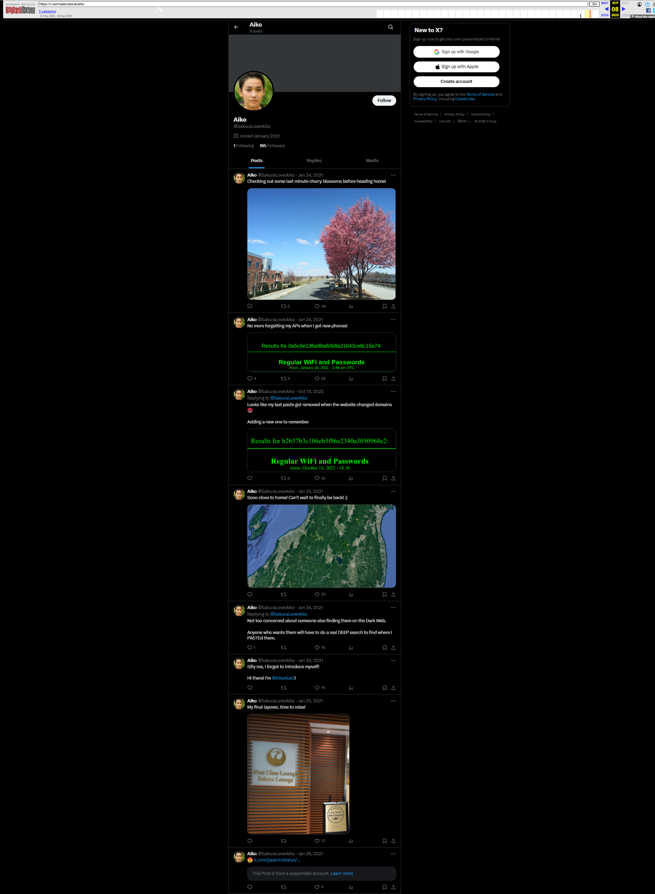
*Account X di Aiko archiviato su web.archive.org*

Il post recuperato conteneva l'informazione mancante: un elenco di reti Wi-Fi con le rispettive password, in cui la stringa alfanumerica visibile era un hash — cioè il risultato di una funzione matematica che prende un contenuto (testo, file, immagine) e lo trasforma in una stringa identificativa unica, di lunghezza fissa, come un'impronta digitale: anche una minima modifica al contenuto originale cambia completamente l'hash risultante. Questa stessa funzionalità — testo accessibile pubblicamente tramite un link, senza bisogno di registrazione o identificazione — torna utile anche a chi vuole condividere qualcosa senza lasciare tracce dirette legate alla propria identità reale, e quindi per usi potenzialmente illegittimi.

Sul profilo X di Aiko c'è anche un commento dell'attaccante: *"Not too concerned about someone else finding them in the Dark web. Anyone who wants them will have to do a real DEEP search to find where I PASTEd them."* Il gioco di parole è intenzionale ed è un altro indizio per risolvere la domanda finale di questo task, cioè il BSSID.

Le parole DEEP e PASTE(d), scritte in maiuscolo, sottolineano il gioco di parole che, unito al suggerimento di cercare sul dark web, lascia intendere che potrebbe esistere anche lì un servizio simile a Pastebin, chiamato forse DEEP PASTE. DeepPaste funziona secondo lo stesso principio di Pastebin — un link univoco per recuperare un contenuto senza registrazione — con la differenza che qui l'identificatore usato è un hash, anziché un ID casuale come su Pastebin. A questo punto dell'esercizio ho incontrato le mie maggiori difficoltà, e ho anche imparato moltissimo su queste applicazioni di hosting di testo e sul dark web. Ho scaricato e, per la prima volta, usato Tor Browser sulla mia macchina virtuale, insieme a motori di ricerca come Ahmia e Torch. Ho scoperto che cercare qualcosa sul dark web è molto diverso dal cercare sul clear web, e che i siti scompaiono da un giorno all'altro, ma le alternative spuntano ancora più in fretta. L'obiettivo di andare sul dark web per questo task era trovare Deep Paste per recuperare le informazioni necessarie dall'hash esposto da Aiko, e quindi ottenere la risposta, o altri indizi che potessero aiutarmi a completare il Task 5; tuttavia, dopo parecchio (molto) studio e dopo numerosi tentativi e ricerche, mi sono fermata. Forse semplicemente non sono ancora abbastanza esperta, ma da quanto ho capito, è molto probabile che il sito Deep Paste non sia più raggiungibile. Anche trovare un servizio di paste funzionante e attivo oggi non aiuterebbe a recuperare lo specifico contenuto che l'attaccante aveva salvato nel 2021 su Deep Paste, perché l'hash esposto nel tweet è legato ESCLUSIVAMENTE al database di Deep Paste: un servizio diverso ha un database completamente diverso.

Non essendo riuscita a verificare personalmente il contenuto originale su Deep Paste, ho ottenuto il valore dell'SSID di cui avevo bisogno, insieme ad altri indizi, da un walkthrough pubblicato online — un'informazione di seconda mano che comunque ho confermato in modo indipendente con una ricerca su WiGLE. Il nome della rete, cioè l'SSID, è: **DK1F-G**. Tra i risultati c'erano altre reti Wi-Fi con le rispettive password salvate nell'elenco per non dimenticarle; tra queste anche il Wi-Fi pubblico della città di Hirosaki, in Giappone.

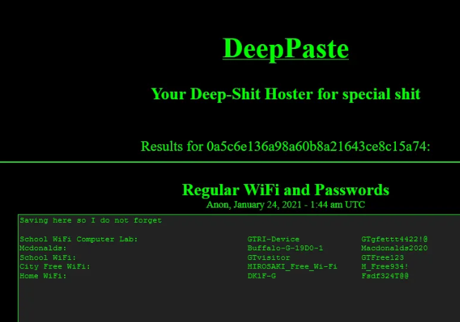
*Risultati DeepPaste*

Con questi indizi, sono riuscita ad andare avanti.

Su WiGLE, la pagina di ricerca avanzata permette di inserire vari dati per risalire a ulteriori informazioni. WiGLE non cerca un punto geografico esatto (sarebbe troppo restrittivo), ma cerca all'interno di un rettangolo geografico, cioè un intervallo di latitudine e longitudine. Una volta capito questo, ho fatto una prova. Ho cercato la città di Hirosaki su Google Maps per ottenerne le coordinate e restringere la ricerca nel database.

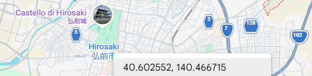
*Coordinate della città di Hirosaki, Giappone*

Inserendo l'SSID (DK1F-G) insieme a un intervallo di coordinate che copre l'area di Hirosaki su WiGLE, la ricerca ha restituito il risultato che cercavo: il BSSID → **84:af:ec:34:fc:f8**.

Per curiosità, ho verificato se il filtro geografico fosse davvero necessario per trovare il BSSID, oppure se l'SSID da solo bastasse a isolare un risultato univoco. Ho ripetuto la stessa ricerca lasciando vuoti i campi di longitudine e latitudine, e ho ottenuto lo stesso risultato. Questo può accadere quando l'SSID — il nome dato alla propria rete Wi-Fi — è davvero originale e unico. Tuttavia, il BSSID resta il dato effettivamente utile per la geolocalizzazione fisica.

**Cosa ho imparato:**

Con questo task ho fatto la mia prima ricerca sul dark web e ho imparato molto a riguardo, in particolare come si cerca su questa rete; i vari tipi di hash e i loro utilizzi (avevo già usato SHA-256 per validare prove in altri esercizi), e a cosa servono i servizi di paste; ho imparato la differenza tra SSID e BSSID e come un router possa essere geolocalizzato.

## TASK 6 - HOMEBOUND

Nell'ultimo task della room, il numero 6, l'indizio iniziale racchiude una grande lezione: nell'OSINT, spesso non esiste una "prova schiacciante" che indichi con certezza un'unica risposta definitiva. Un analista OSINT deve invece imparare a sintetizzare più informazioni per trarre una conclusione su ciò che è probabile, improbabile o possibile.

**Procedura:**

Per concludere la room, è stato necessario usare tutti i dati disponibili e le informazioni raccolte in precedenza per risalire all'attaccante e, nello specifico, a dove vive. Le domande del Task 6 fanno riferimento in particolare ai tweet pubblicati dall'attaccante — già notati in precedenza — per scoprire il nome dell'aeroporto di partenza, il nome dell'aeroporto dell'ultimo scalo prima di raggiungere la destinazione, il nome del lago al centro della foto aerea pubblicata sull'account e infine la probabile città natale dell'attaccante.

La prima domanda chiede l'aeroporto più vicino al luogo in cui l'attaccante ha condiviso una foto prima di partire.

Prima di partire, Aiko aveva pubblicato un tweet con la seguente foto.

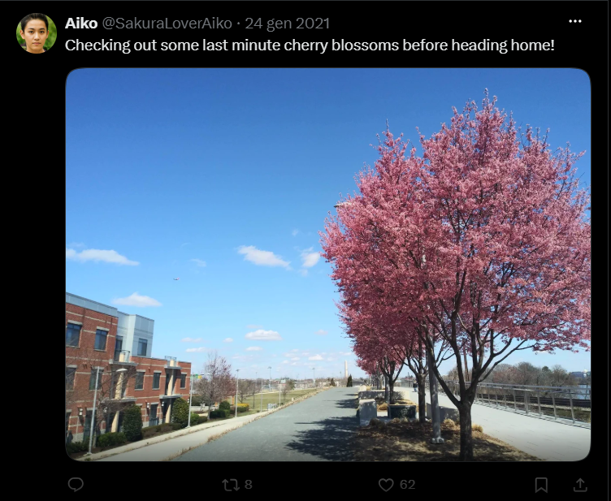
*Tweet con i ciliegi in fiore prima della partenza*

Nella foto si vedono alcuni ciliegi lungo il viale a destra; una passerella (probabilmente pedonale) con barriere di sicurezza lungo il bordo; alcuni edifici a sinistra; un ampio spazio verde, forse un campo sportivo, più avanti a sinistra; e, sullo sfondo, una struttura bianca molto alta a forma di torre. Era subito chiaro che questa struttura fosse l'indizio principale. Prima però ho provato a cercare l'intera immagine, senza ritagliare la torre, tramite Google Image Search, ma gli unici risultati trovati erano i post di Aiko stessa e le soluzioni della room pubblicate nel corso degli anni. Ho provato anche con Yandex, ottenendo lo stesso risultato.

Questo primo tentativo mi ha fatto capire quanto sia importante analizzare a fondo ogni dettaglio di un'immagine, per condurre una ricerca non solo efficace ma anche più mirata e affidabile.

Ho quindi ingrandito l'immagine e ritagliato il dettaglio della torre (nonostante la scarsa risoluzione), per fare un test usando l'estensione Search by Image su Brave, che permette di cercare un'immagine su più motori di ricerca contemporaneamente.

*Dettaglio della torre a bassissima risoluzione*

Ho eseguito la ricerca su numerosi motori — Google, Yandex, TinEye, Baidu e altri — ma in questo caso l'unico a trovare una corrispondenza esatta è stato Google. La torre in questione è il **Washington Monument** (Washington, D.C., USA). Poi, con una semplice ricerca su Google, ho scoperto che l'aeroporto più vicino all'obelisco è il **Ronald Reagan Washington National Airport (DCA)**, situato ad Arlington (Virginia), a circa 6 km dal monumento, confermato tramite Google Maps. Il codice di questo aeroporto (**DCA**) è la risposta alla prima domanda.

Per scoprire in quale aeroporto l'attaccante avesse fatto il suo ultimo scalo, è tornato utile un altro post di Aiko, in cui dichiara esplicitamente che si tratta del suo ultimo scalo.

*Tweet "My final layover, time to relax!"*

La foto mostra diversi dettagli: in primo piano, il testo "5 Star Airline Skytrax". Una breve ricerca ha rivelato che si tratta di un premio prestigioso assegnato dall'agenzia di rating britannica Skytrax, riconosciuto a chi raggiunge un'elevata qualità nei servizi e nei prodotti aeroportuali e di bordo. L'elegante insegna sulla parete indica inoltre che si tratta di una lounge di un aeroporto.

Anche qui ho usato la ricerca inversa per immagini di Google. Questa volta la ricerca ha restituito risultati pertinenti, escludendo ovviamente quelli legati alla sfida stessa. L'IA mi aveva già dato subito la risposta, ma in un'indagine reale è importante verificare la fonte. Da queste immagini ho scoperto che la lounge appartiene alla Japan Airlines First Class, e controllando i risultati pertinenti si vede che si tratta nello specifico della lounge dell'**aeroporto di Tokyo Haneda**, il cui codice è la risposta alla seconda domanda: **HND**.

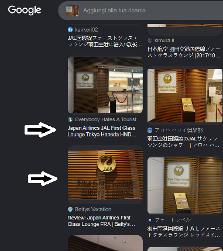
*Risultati della ricerca sulla lounge aeroportuale*

La terza domanda del Task 6 chiede il nome del lago che compare nella foto aerea pubblicata da Aiko.

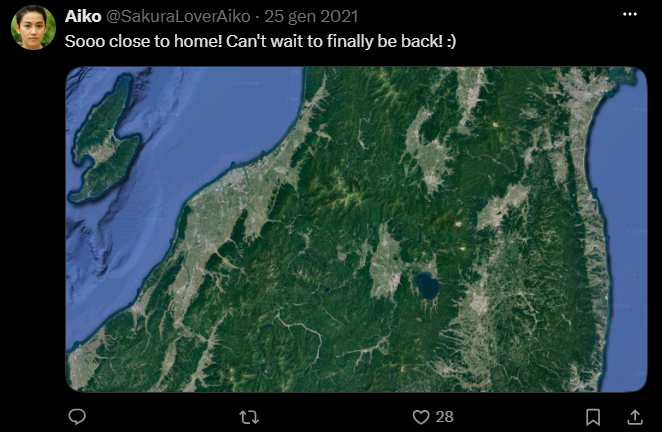
*Foto satellitare pubblicata da Aiko*

Il lago è chiaramente visibile nella foto, centrato leggermente a destra; a sinistra c'è un'isola dalla forma molto particolare. Considerando gli altri indizi raccolti finora — lo scalo a Tokyo e il riferimento a Hirosaki emerso dal nome della rete Wi-Fi nel task precedente — c'è ormai una ragionevole certezza che l'immagine mostri una porzione di territorio giapponese.

Ho quindi usato Google Earth, che offre immagini molto dettagliate, cercando "Hirosaki, Japan". L'immagine mostrava effettivamente un lago dalla forma simile a quella nel tweet: il **lago Towada**. Tuttavia, l'isola dalla forma particolare a sinistra non compariva in quell'area.

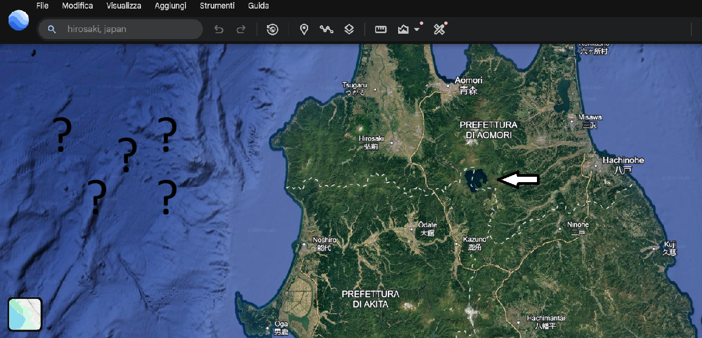
*Lago Towada*

Ho quindi effettuato uno zoom indietro per trovare quell'isola. L'isola dalla forma inconfondibile è **Sado**. Nella stessa area, più a destra, esattamente come nella foto, c'è un altro lago: **Inawashiro**. Anche la forma del territorio corrisponde a quella nel tweet. Questa è la risposta corretta alla quarta domanda.

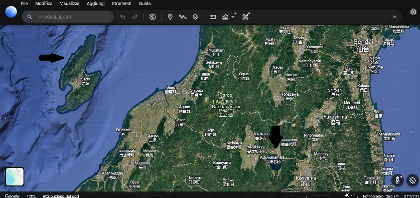
*Lago Inawashiro e Isola di Sado*

Questo passaggio è stato un esempio concreto di come un'ipotesi iniziale plausibile possa essere corretta valutando dettagli importanti, invece di fermarsi a un'osservazione superficiale.

L'ultima domanda del Task 6, e dell'intera room, chiede quale città l'attaccante consideri più probabilmente come casa propria. Con tutti gli indizi raccolti, in particolare il riferimento a Hirosaki, la risposta è proprio quella: **Hirosaki**.

**Cosa ho imparato:**

Questo task mi ha fatto capire che nell'OSINT raramente esiste una singola prova definitiva, e quindi un analista deve essere in grado di mettere insieme più indizi indipendenti per formulare l'ipotesi più ragionevole.

## CONCLUSIONE

Percorrere la Sakura Room task dopo task, fermandomi a comprendere fino in fondo ogni concetto tecnico incontrato lungo il percorso — dai metadati SVG, alla cronologia dei commit immutabile di GitHub, alla struttura delle transazioni Ethereum, al funzionamento di WiGLE, fino al ragionamento necessario per muoversi nel Dark Web — mi ha permesso di collegare competenze di SOCMINT, tecniche di Blockchain Intelligence e GEOINT, in modo simile a quanto accadrebbe in un caso reale. Ma soprattutto, mi ha dato una comprensione molto più profonda della metodologia investigativa e del ciclo dell'intelligence, che applicherò sicuramente nei miei futuri studi e nel mio futuro lavoro.
